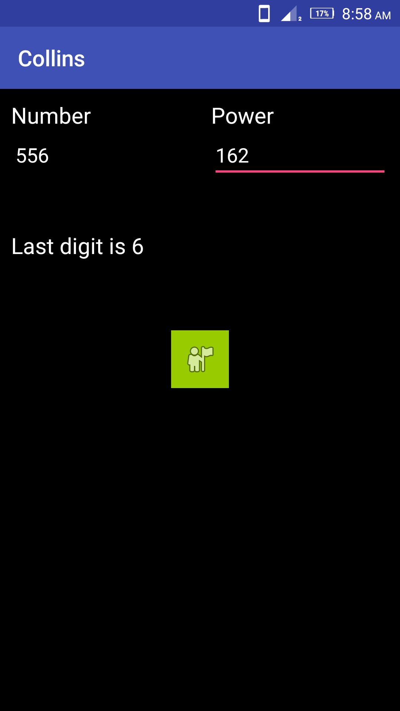

Collins
=======
I created this simple working android application while i was preparing GRE. What this application does is- it gives last digit of any number with any power:
You give a number and its power then you will get last digit of that big number. Collins is the name of institue where i was studying in, thus the app name.
It's works as shown in screenshot below

|
|

